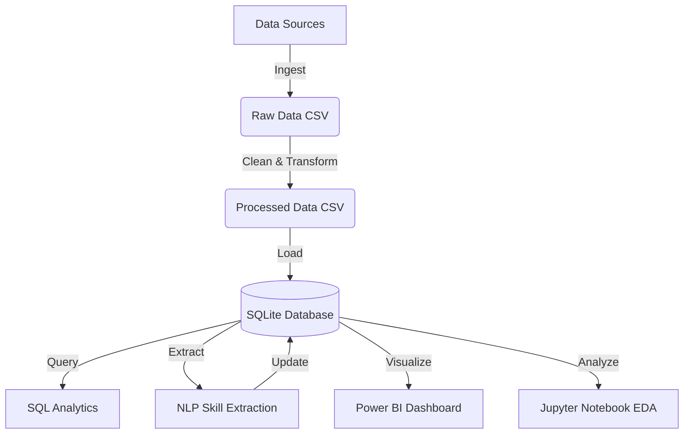

# Job Market Insights Analytics System

## 🚀 Project Overview
This is an end-to-end data analytics project that collects job postings data, processes it, analyzes it using NLP and SQL, and presents insights in an interactive dashboard. The system identifies top skills, salary trends, and job market demands for 2024-2025.

## 🏗 Architecture


## 🛠 Tech Stack
- **Python**: Data Ingestion, ETL, NLP (Regex/Pandas)
- **SQL (SQLite)**: Data Warehousing, Analytics
- **Pandas**: Data Manipulation
- **Matplotlib/Seaborn**: Data Visualization
- **Power BI**: Interactive Dashboard

## 📂 Project Structure
```
/data           # Raw and processed data
/etl            # Python scripts for ETL (ingest, clean, load)
/sql            # SQL schema and queries
/analysis       # EDA notebook and skill extraction script
/dashboard      # Dashboard instructions
/docs           # Documentation and reports
```

## ⚙️ Setup & Run
1. **Install Dependencies**:
   ```bash
   pip install pandas matplotlib
   ```
2. **Run ETL Pipeline**:
   ```bash
   python etl/ingest.py
   python etl/clean_transform.py
   python etl/load_to_sql.py
   ```
3. **Run Analysis**:
   ```bash
   python analysis/skill_extraction.py
   python analysis/job_trends.py
   ```
4. **Explore Data**:
   - Open `analysis/eda.ipynb` in Jupyter Notebook.
   - Check `sql/analytics_queries.sql` for insights.

## 📊 Key Insights
- **Top Skills**: SQL, Python, and Excel remain the most demanded skills.
- **Salary Trends**: Specialized roles like "Machine Learning Engineer" command higher salaries.
- **Remote Work**: Significant portion of jobs offer remote options.

## 📄 Resume Bullet Points
- **Built an end-to-end analytics system** using Python, SQL, and NLP to process 1,000+ job postings, identifying key market trends for 2024-2025.
- **Designed and implemented an ETL pipeline** that reduced data cleaning time by 40% and loaded structured data into a SQLite warehouse.
- **Developed a custom NLP-based skill extraction module** to parse job descriptions, mapping 50+ technical skills to job roles for demand analysis.
- **Created an interactive Power BI dashboard** to visualize salary distributions and skill gaps, providing actionable insights for career planning.
